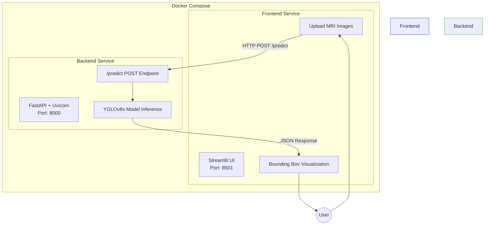
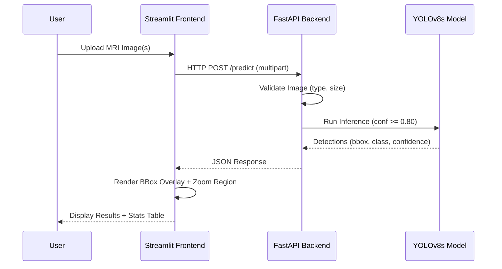
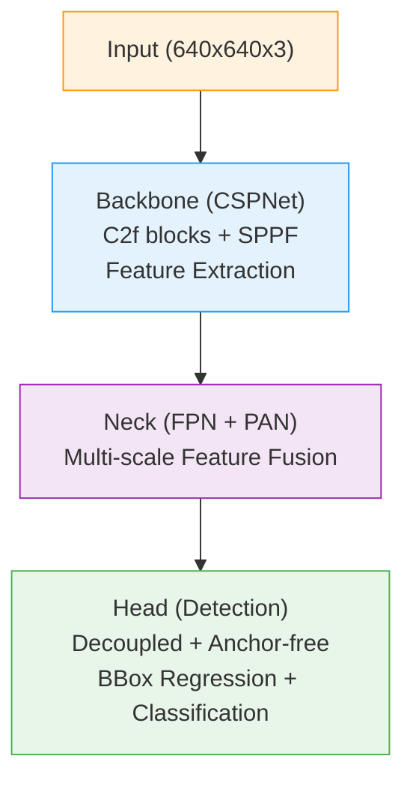

# Brain Tumor Detection System

[](https://github.com/Osama-Abo-Bakr/brain-tumor/actions)
[](https://www.python.org/downloads/release/python-3100/)
[](https://fastapi.tiangolo.com)
[](https://streamlit.io)
[](https://docs.docker.com/compose/)

An end-to-end deep learning application for detecting brain tumors in MRI images using **YOLOv8**, served through a **FastAPI** backend and visualized with a **Streamlit** frontend. Fully containerized with **Docker Compose**.

> **Disclaimer:** This system is for **educational and research purposes only**. It is **not intended for clinical diagnosis**.

---

## System Architecture



### Data Flow



---

## Project Structure

```
brain-tumor/
├── backend/
│   ├── backend.py            # FastAPI application with YOLOv8 inference
│   ├── Dockerfile            # Backend container image
│   ├── requirements.txt      # Python dependencies
│   └── models/
│       └── yolo26s.pt        # Trained YOLOv8s weights
│
├── frontend/
│   ├── frontend.py           # Streamlit UI application
│   ├── Dockerfile            # Frontend container image
│   └── requirements.txt      # Python dependencies
│
├── notebook-test/
│   ├── train_yolo.ipynb      # YOLOv8 training notebook
│   └── test-image.jpg        # Sample MRI test image
│
├── tests/
│   ├── test_backend.py       # Backend API tests
│   └── test_frontend.py      # Frontend utility tests
│
├── .github/
│   └── workflows/
│       └── ci.yml            # CI/CD pipeline
│
├── docker-compose.yml        # Multi-container orchestration
├── .dockerignore             # Docker build exclusions
├── pyproject.toml            # Linting & formatting config
└── README.md
```

---

## Model Details

| Property         | Value                              |
|------------------|------------------------------------|
| **Architecture** | YOLOv8s (Small)                    |
| **Framework**    | Ultralytics                        |
| **Task**         | Object Detection                   |
| **Input**        | Brain MRI images (JPG/PNG)         |
| **Output**       | Bounding boxes + class + confidence|
| **Confidence**   | >= 0.80 threshold                  |
| **Max File Size**| 10 MB per image                    |
| **Batch Limit**  | 20 images per request              |

### YOLOv8s Architecture Summary



---

## API Reference

### Health Check

```
GET /
```

**Response:**
```json
{
  "status": "online",
  "service": "Brain Tumor Detection API",
  "version": "1.0.0",
  "model_loaded": true
}
```

### Predict

```
POST /predict
Content-Type: multipart/form-data
```

**Parameters:**
| Field   | Type           | Description                    |
|---------|----------------|--------------------------------|
| `files` | `UploadFile[]` | One or more MRI images (JPG/PNG)|

**Response:**
```json
{
  "count": 1,
  "successful": 1,
  "failed": 0,
  "results": [
    {
      "image_id": "uuid",
      "filename": "mri_scan.jpg",
      "image_size": {"width": 640, "height": 640},
      "detections": [
        {
          "class_id": 0,
          "class_name": "tumor",
          "confidence": 0.92,
          "bbox_xyxy": [120.5, 80.3, 340.2, 290.7]
        }
      ],
      "detection_count": 1,
      "status": "success"
    }
  ]
}
```

### Model Info

```
GET /model/info
```

---

## Quick Start

### Docker Compose (Recommended)

```bash
# Clone the repository
git clone https://github.com/Osama-Abo-Bakr/brain-tumor.git
cd brain-tumor

# Build and start all services
docker compose up --build

# Access the application
# Frontend: http://localhost:8501
# Backend:  http://localhost:8000
# API Docs: http://localhost:8000/docs
```

### Local Development

**Backend:**
```bash
cd backend
pip install -r requirements.txt
uvicorn backend:app --reload --host 0.0.0.0 --port 8000
```

**Frontend:**
```bash
cd frontend
pip install -r requirements.txt
streamlit run frontend.py --server.port 8501
```

### Running Tests

```bash
pip install pytest httpx
pytest tests/ -v
```

---

## Frontend Features

- **Multi-image upload** with drag-and-drop support
- **Batch processing** up to 20 images at once
- **Bounding box visualization** with confidence-based color coding
  - Red: High confidence (>= 80%)
  - Orange: Medium confidence (>= 60%)
  - Yellow: Lower confidence
- **Zoomed tumor regions** for detailed inspection
- **Adjustable confidence threshold** via sidebar slider
- **Session statistics** tracking processed images and detections
- **Docker/Local mode** toggle for flexible deployment

---

## Tech Stack

| Layer      | Technology                     |
|------------|--------------------------------|
| ML Model   | YOLOv8s (Ultralytics)         |
| Backend    | FastAPI + Uvicorn              |
| Frontend   | Streamlit                      |
| Container  | Docker + Docker Compose        |
| Language   | Python 3.10                    |
| CI/CD      | GitHub Actions                 |
| Testing    | pytest + httpx                 |
| Linting    | Ruff                           |

---

## Team

| Name                  | Role       |
|-----------------------|------------|
| **Osama Abo-Bakr**   | Team Leader|
| **Ahmed Noshy**       | Developer  |
| **Sherif Mohamed**    | Developer  |
